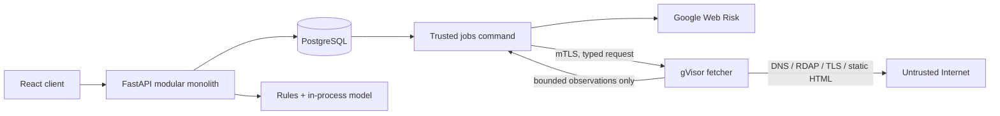

# PhishGuard

PhishGuard is a privacy-preserving phishing-risk assessment capstone. It always performs URL-only analysis first and makes external enrichment an explicit, consented second stage. Results retain evidence provenance and distinguish missing evidence from a benign finding.

> This is an experimental decision-support system, not a guarantee that a URL is safe. Never open a submitted URL to verify a result.

## Architecture



The web, jobs, migrations, cleanup, and evaluation commands share one application package and image. Only target-controlled retrieval crosses into the separate credentialless fetcher. PostgreSQL provides both persistence and leased jobs; there is no Redis, Pub/Sub, service mesh, or model service.

## Local development

Prerequisites: Docker with Compose. Native development additionally needs Python 3.13, `uv`, Node 22, and `pnpm` through Corepack.

```sh
docker compose up --build
```

Open <http://localhost:8080>. Compose enables development authentication and an HTTP-only fetcher inside the local Docker network. These overrides are never present in Kubernetes.

Useful commands:

```sh
make test
make build
make down
```

## Google Cloud demo deployment

The deployment provisions a regional GKE Autopilot cluster, private Cloud SQL PostgreSQL, VPC/NAT, Artifact Registry, KMS, Secret Manager, versioned object storage, a global Gateway address, managed certificate, Cloud Armor, and Identity Platform email/password authentication with TOTP MFA. It assumes an existing Google Cloud project, billing account, Cloud DNS managed zone, and authenticated `gcloud` application-default credentials.

```sh
make bootstrap PROJECT_ID=my-project
export WEB_RISK_API_KEY='replace-me'
make deploy PROJECT_ID=my-project DOMAIN=phishguard.example.org TAG=v0.1.0
```

`bootstrap` enables the bootstrap APIs, creates remote Terraform state, and creates runtime secret placeholders and the internal CA. `deploy` discovers the containing Cloud DNS zone (or accepts `DNS_ZONE=...`), applies Terraform, submits Cloud Build, runs checks, pushes both images, resolves their digests, applies Kubernetes resources, waits for migration, rollouts, the managed certificate, and Gateway programming, then smoke-tests `/healthz`.

Configure pull-request triggers with `cloudbuild.ci.yaml` and the unprivileged `phishguard-cloud-build-ci` service account. Configure the `main` trigger separately with `cloudbuild.yaml`, the deployment service account, manual approval, and `_DEPLOY=true`. Google Cloud resources incur charges. This repository intentionally provisions one demo environment, not production HA.

The Terraform and Kubernetes definitions have been validated/rendered locally, but no live GCP deployment, live Web Risk request, backup restoration, or deployed smoke test is claimed. Run and archive those exercises in the target project before treating the demo as accepted.

## Current scope and acceptance gaps

The implemented vertical slices cover local-only analysis, consented queued enrichment, the isolated fetcher, evidence fusion, session/RBAC foundations, governed review/admin records, and reproducible offline evaluation. The responsive client follows the device colour preference, exposes dedicated How it works and Privacy routes, and includes an install manifest and application icons without caching sensitive scan data offline. Known boundaries are explicit:

- research experiments and privacy-filtered exports are processed by the suspended, operator-triggered evaluation job and published to governed object storage; this remains an experimental batch workflow rather than an interactive notebook service;
- account export, retention preferences, and scan-data deletion govern PhishGuard records only; deleting scan data revokes application sessions but does not delete the delegated Google Identity Platform identity;
- no versioned load report, manual accessibility report, user-study result, live Web Risk smoke result, or backup-restore evidence has been produced;
- the first deploy remains `RULE_ONLY` until a governed dataset and model-policy pair complete their human approval fields.

See the [traceability matrix](docs/traceability.md) and [technical-debt register](docs/debt-register.md) for the verification boundary.

## Security and privacy invariants

- `LOCAL_ONLY` never initiates DNS, RDAP, target, reputation, or cached external-evidence lookup.
- Enrichment requires affirmative consent and records the notice version.
- The fetcher accepts only mTLS traffic from jobs, has no service-account token or cloud IAM, uses gVisor, and cannot reach private/reserved IPv4 ranges.
- Raw URLs are encrypted with Cloud KMS and indexed only by keyed HMAC. Logs must not contain raw URLs, query strings, fragments, email addresses, tokens, or fetched bodies.
- `NO_MATCH` is neutral. Timeouts, policy skips, unavailable providers, and safety rejections remain explicit evidence states.
- Google Web Risk is optional evidence and cannot determine the final classification without local corroboration.

See [the documentation index](docs/README.md), especially the threat model, traceability matrix, privacy notice, provider notice, and operational runbooks.

## Repository layout

- `backend/`: modular monolith, API, jobs, persistence, and evaluation.
- `frontend/`: React/Vite user interface and local design system.
- `fetcher/`: isolated SSRF-hardened retrieval service.
- `deploy/`: Kustomize manifests and bootstrap/deploy scripts.
- `infra/terraform/`: the single GCP demo environment.
- `docs/`: architecture decisions, assurance artefacts, notices, and runbooks.

Licensed under the [MIT License](LICENSE).
